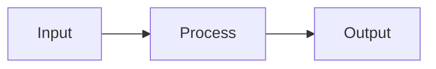

# toylet-notes

A collection of notes intended for use with [reading-desk](https://github.com/breakds/reading-desk).

## Content Format

Notes live in the `notes/` directory using the **directory-based format** (supports images):

```
notes/
├── topic-name/
│   ├── index.md        # Main note file
│   ├── diagram.png     # Co-located images
│   └── ...
└── another-topic/
    └── index.md
```

### Note Structure

Each note must have YAML frontmatter:

```markdown
---
id: topic-name
title: Human Readable Title
author: Break Yang
date: 2026-01-20
---

# Section Title [id=section-id]

Section content...

# Another Section [id=another-section]

More content...
```

**Frontmatter fields:**
- `id`: Unique identifier (defaults to directory name)
- `title`: Display title
- `author`: Author name
- `date`: Creation/update date (YYYY-MM-DD)

### Sections

Sections are H1 headers with an `[id=...]` attribute:

```markdown
# Gradient Descent [id=gradient-descent]
```

- Section IDs must be unique within the note
- Use kebab-case for section IDs

### Cross-References

Link to sections in any note:

```markdown
See [#section:bayes-theorem] for the mathematical foundation.
```

### Pull Sections

Import sections from other notes:

```markdown
# [pull:id=gradient]
```

### LaTeX

- Inline: `$E = mc^2$`
- Block:
```markdown
$$
\nabla f = \begin{bmatrix} \frac{\partial f}{\partial x} \\ \frac{\partial f}{\partial y} \end{bmatrix}
$$
```

### Mermaid Diagrams

````markdown

````

### Images

Use relative paths for co-located images:

```markdown

```

## Guidelines for Writing Notes

1. **Focus on intuition** - These are "toylet" notes; emphasize intuitive explanations with concrete examples
2. **Leverage cross-references** - Connect related concepts across notes
3. **Use diagrams liberally** - Mermaid for flow/architecture, images for visual concepts
4. **Keep sections atomic** - Each section should be independently openable in reading-desk
5. **Avoid redundancy** - Use pull sections to reuse content instead of duplicating
