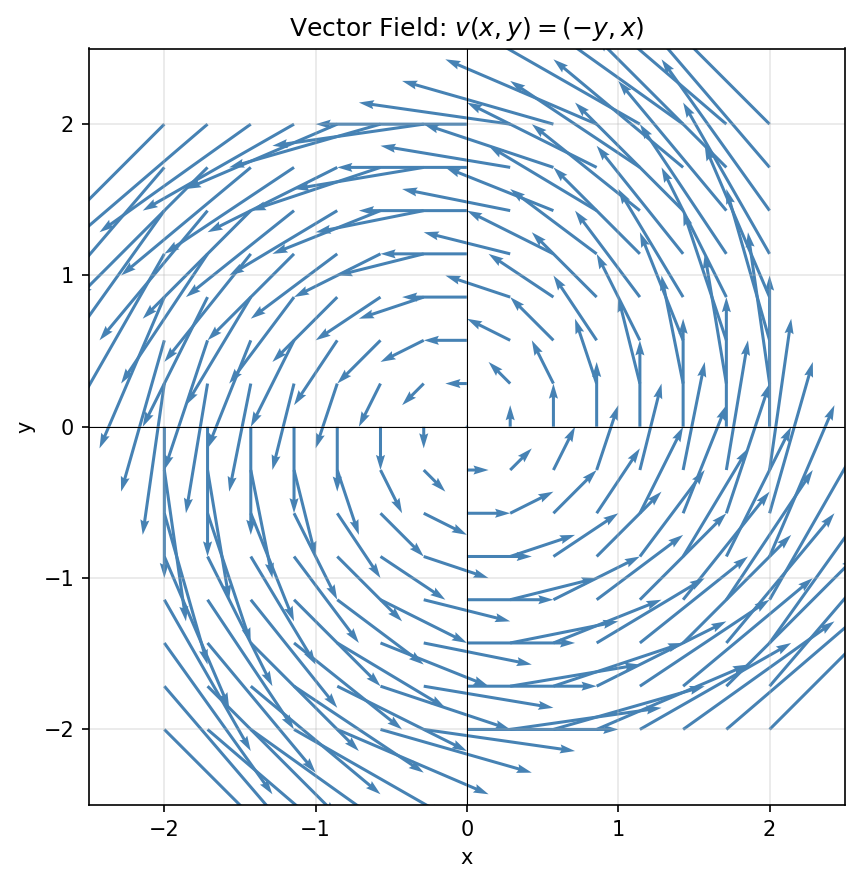
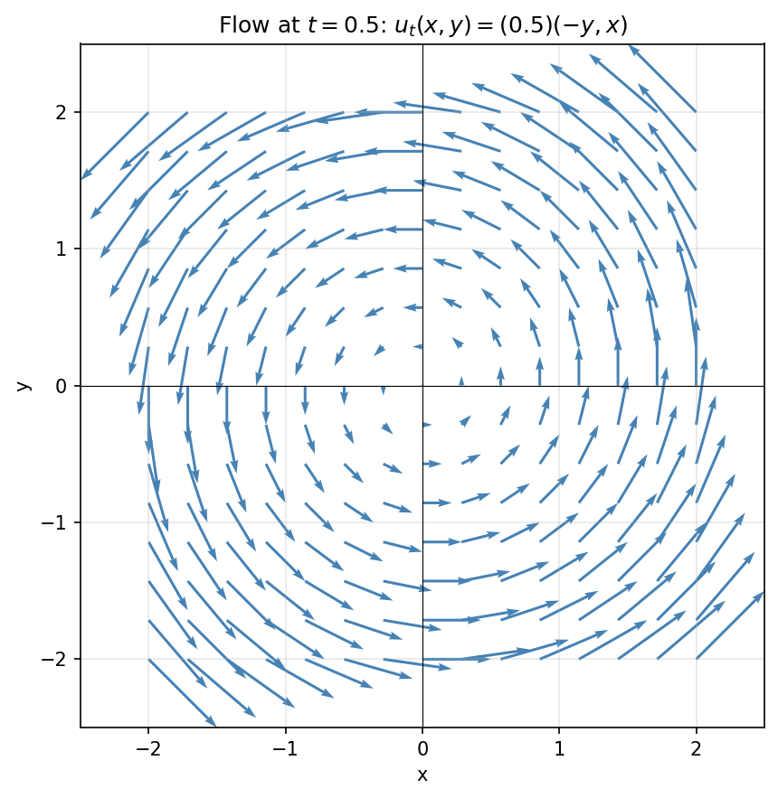
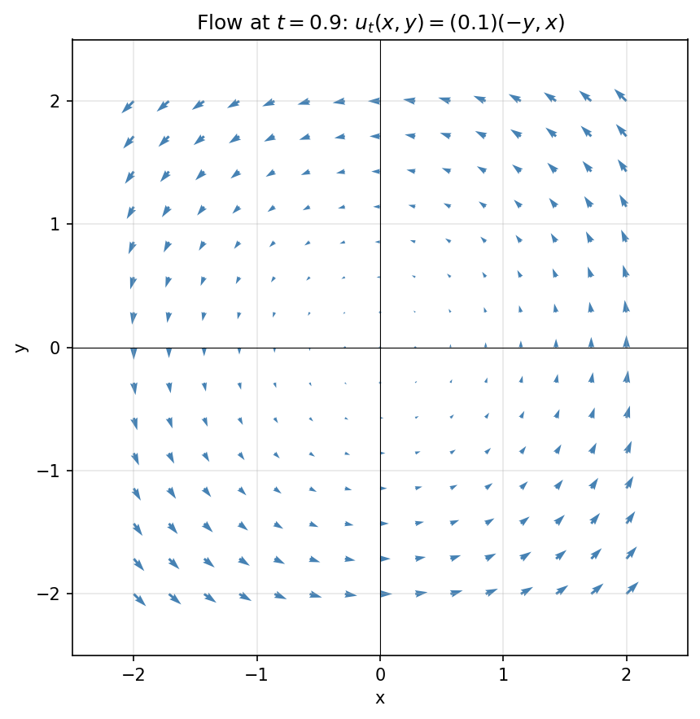
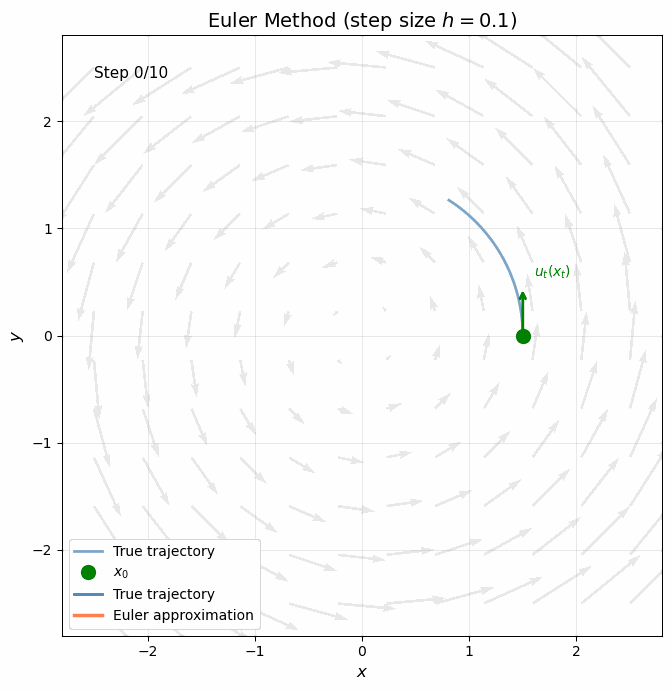
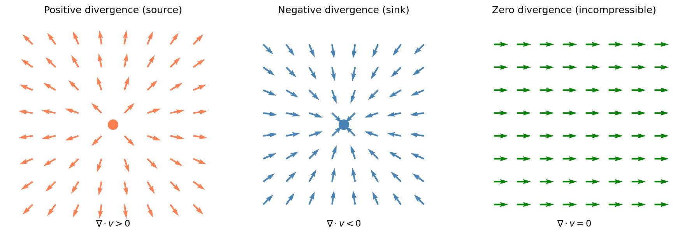
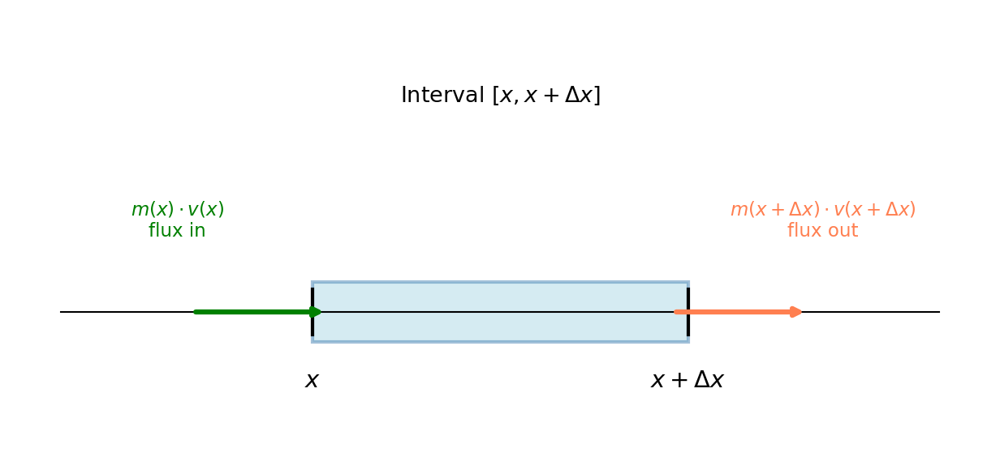
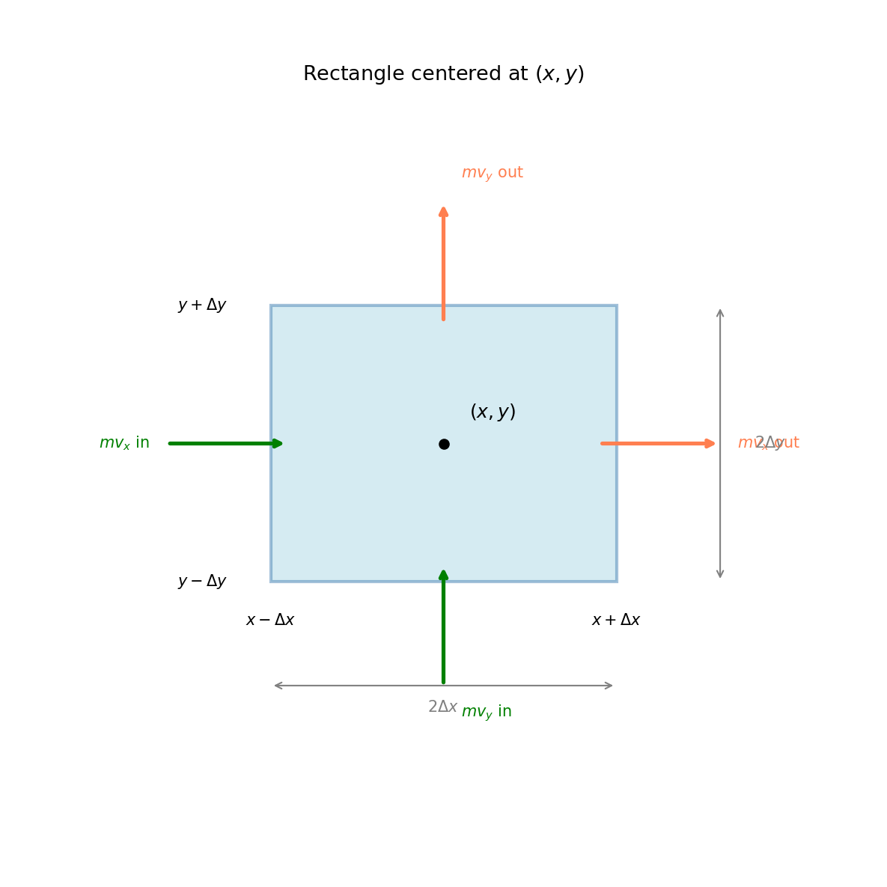
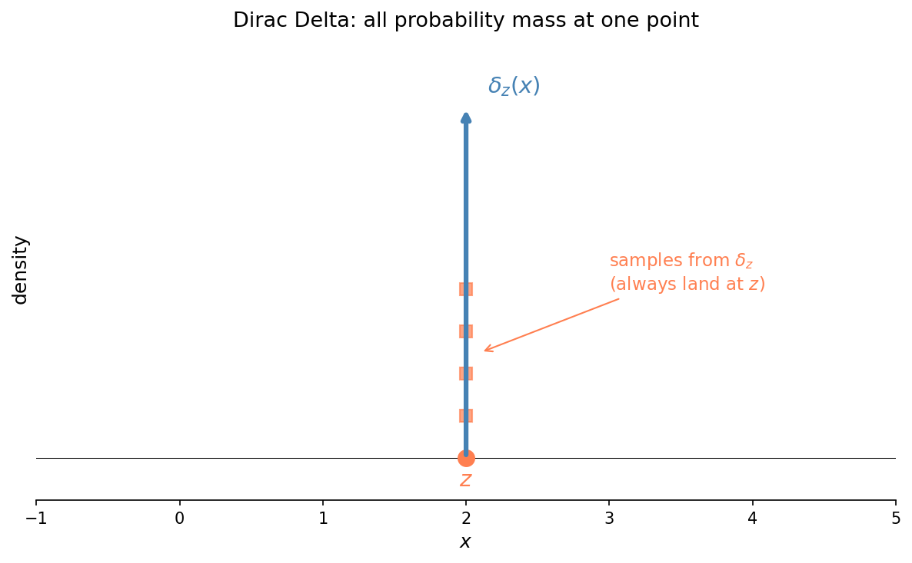

# Vector Field [id=vector-field]

A vector field on the space $\mathbb{R}^d$ is a function $v: \mathbb{R}^d \rightarrow \mathbb{R}^d$, which assigns a vector to each point in the space. Think of it as placing a little arrow at every location—the arrow tells you both a direction and a magnitude at that point.

Below is an example vector field on the plane ($\mathbb{R}^2$), defined by $v(x, y) = (-y, x)$. Notice how the arrows form a counterclockwise rotation around the origin:

Vector fields are commonly used to model things like fluid velocity (the arrow at each point shows which way the fluid is moving and how fast) or force fields (e.g., gravitational or electromagnetic fields).

# Flow [id=flow]

A flow on the space $\mathbb{R}^d$ is a function $u: \mathbb{R}^d \times \mathbb{R} \rightarrow \mathbb{R}^d$. It defines a [#section:vector-field] at each time $t$. In other words, a flow is a time-varying vector field—at each moment, you have a complete vector field, but that field itself evolves as time progresses.

We often write $u_t(x)$ instead of $u(x, t)$ to emphasize that for a fixed $t$, we get a vector field $u_t$.

Below is an example flow defined by $u_t(x, y) = ((1-t)(-y), (1-t)(x))$. As $t$ increases from 0 toward 1, the rotational velocity gradually decreases:

Physically, flows can model scenarios like fluid velocity that changes over time—imagine a whirlpool that gradually slows down.

# Euler Method (Simulating a Flow) [id=euler-method]

Given a [#section:flow] $u_t(x)$, how do we compute where a particle starting at $x_0$ ends up after following the flow from $t=0$ to $t=1$?

The exact answer requires solving the ODE:

$$
\frac{dx}{dt} = u_t(x), \quad x(0) = x_0
$$

The **Euler method** approximates this by taking small discrete steps. The idea is simple: at each moment, pretend the velocity is constant for a small time step $h$, then jump in that direction.

## The algorithm

Starting from $x_0$ at $t=0$, repeat until $t=1$:

$$
x_{t+h} \leftarrow x_t + u_t(x_t) \cdot h
$$

In other words: look at the current velocity $u_t(x_t)$, move in that direction for time $h$, then re-evaluate.

## Visualization

The gif below shows Euler's method in action. The blue curve is the true trajectory; the red steps show the Euler approximation. With smaller step sizes, the approximation improves.

## Trade-off

- **Smaller $h$**: More accurate, but requires more computation steps
- **Larger $h$**: Faster, but the approximation drifts from the true path

In practice, more sophisticated methods (Runge-Kutta, adaptive step sizes) are often used, but Euler's method captures the core idea.

# The Divergence Operator [id=divergence-operator]

The divergence of a [#section:vector-field] $v$ measures how much the field "spreads out" or "converges" at each point. Think of $v$ as describing fluid velocity:

- **Positive divergence** at a point means fluid is flowing *outward*—like a source or faucet
- **Negative divergence** means fluid is flowing *inward*—like a sink or drain
- **Zero divergence** means no net outflow—the fluid is incompressible at that point

## The definition

For a vector field $v: \mathbb{R}^d \rightarrow \mathbb{R}^d$ with components $v(x) = [v_1(x), v_2(x), \ldots, v_d(x)]$, the divergence is:

$$
(\nabla \cdot v)(x) = \sum_{i=1}^d \frac{\partial v_i}{\partial x_i}(x)
$$

A useful mnemonic: treat $\nabla$ as a "vector of partial derivatives" $\nabla = \left[ \frac{\partial}{\partial x_1}, \ldots, \frac{\partial}{\partial x_d} \right]$, then divergence is literally the "dot product" $\nabla \cdot v$.

## Examples

**In 1D**, divergence is just the ordinary derivative:

$$
(\nabla \cdot v)(x) = \frac{dv}{dx}(x)
$$

**In 3D**, for a vector field $v = [v_x, v_y, v_z]$:

$$
\nabla \cdot v = \frac{\partial v_x}{\partial x} + \frac{\partial v_y}{\partial y} + \frac{\partial v_z}{\partial z}
$$

To evaluate at a specific point $(a, b, c)$, compute each partial derivative and plug in:

$$
(\nabla \cdot v)(a, b, c) = \frac{\partial v_x}{\partial x}\bigg|_{(a,b,c)} + \frac{\partial v_y}{\partial y}\bigg|_{(a,b,c)} + \frac{\partial v_z}{\partial z}\bigg|_{(a,b,c)}
$$

# Compute The Flux Out of A Volume [id=flux-out-of-volume]

Suppose we have a function $m(x)$ defined on $\mathbb{R}^d$ representing the mass density of some material (think of water) at each location $x$. Each point also has a velocity given by a [#section:vector-field] $v(x)$.

**Question**: In an infinitesimal time $h$, how does the mass at each point $x$ change?

**Answer** (the continuity equation):

$$
\Delta m(x) = - \nabla \cdot (m v)(x) \cdot h
$$

where $\nabla \cdot$ is the [#section:divergence-operator]. Let's derive this intuitively.

## The 1D case

Focus on a small interval $[x, x + \Delta x]$.

Mass flows through the two boundaries:
- **Left boundary**: mass flows *in* at rate $m(x) \cdot v(x)$
- **Right boundary**: mass flows *out* at rate $m(x + \Delta x) \cdot v(x + \Delta x)$

Over time $h$, the interval gains mass:

$$
\Delta \text{mass} = m(x) v(x) h - m(x + \Delta x) v(x + \Delta x) h
$$

The mass change *per unit length* is:

$$
\frac{\Delta \text{mass}}{\Delta x} = \frac{m(x) v(x) - m(x + \Delta x) v(x + \Delta x)}{\Delta x} \cdot h
$$

Taking $\lim_{\Delta x \to 0}$, we get the mass change at point $x$:

$$
\Delta m(x) = -\frac{\mathrm{d}}{\mathrm{d}x}(m v)\bigg|_x \cdot h = -(\nabla \cdot (m v))(x) \cdot h
$$

## The 2D case

Focus on a small rectangle centered at $(x, y)$ with half-widths $\Delta x$ and $\Delta y$.

Mass flows through four edges. Only the velocity component *perpendicular* to each edge matters:

1. **Left edge** ($x - \Delta x$): flux *in* = $m(x-\Delta x, y) \cdot v_x(x-\Delta x, y) \cdot h \cdot 2\Delta y$
2. **Right edge** ($x + \Delta x$): flux *out* = $m(x+\Delta x, y) \cdot v_x(x+\Delta x, y) \cdot h \cdot 2\Delta y$
3. **Bottom edge** ($y - \Delta y$): flux *in* = $m(x, y-\Delta y) \cdot v_y(x, y-\Delta y) \cdot h \cdot 2\Delta x$
4. **Top edge** ($y + \Delta y$): flux *out* = $m(x, y+\Delta y) \cdot v_y(x, y+\Delta y) \cdot h \cdot 2\Delta x$

Net mass change in the rectangle of area $4 \Delta x \Delta y$:

$$
\Delta \text{mass} = \big( m v_x \big|_{x-\Delta x} - m v_x \big|_{x+\Delta x} \big) \cdot 2\Delta y \cdot h + \big( m v_y \big|_{y-\Delta y} - m v_y \big|_{y+\Delta y} \big) \cdot 2\Delta x \cdot h
$$

Dividing by area and taking $\lim_{\Delta x, \Delta y \to 0}$:

$$
\Delta m(x,y) = -\left( \frac{\partial (m v_x)}{\partial x} + \frac{\partial (m v_y)}{\partial y} \right) h = -(\nabla \cdot (m v))(x,y) \cdot h
$$

The pattern generalizes to any dimension: mass change equals negative divergence of the mass flux $m v$.

# Dirac Delta Function [id=dirac-delta-function]

The Dirac delta function $\delta_z(x)$ represents a "distribution" that puts all its probability mass at a single point $z$. Intuitively, think of it as an infinitely tall, infinitely narrow spike centered at $z$, with total area 1.

For any continuous function $f$:

$$
\int f(x) \delta_z(x) dx = f(z)
$$

This "sifting property" extracts the value of $f$ at the point $z$.

While not a true function in the classical sense (it's a **distribution** or **generalized function**), $\delta_z$ is useful for describing probability distributions concentrated at a single point. If you sample from $\delta_z$, you always get exactly $z$—there's no randomness at all.

