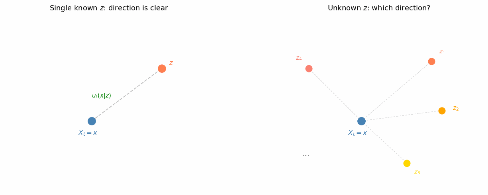

# The Denoising Intuition [id=denoising-intuition]

The intuition behind [#section:vae] teaches us that sampling from a simple distribution works well, as long as we can map those samples to the target distribution. The idea in [#section:step-by-step-dist-model] suggests this mapping can be done incrementally. Flow matching models build on this idea—let's develop intuition for how they learn to sample from a data distribution $p(z)$.

## Can you denoise it?

Below is an image of a cat (credit to GPT-5.2). If we add some Gaussian white noise to it, it becomes a noisy cat image. It is not hard for you to "denoise" it in your mind and obtain a cat image that somewhat resembles the original, right? The denoised image in your mind may not be an exact copy of the original, but it would be close. This example illustrates that learning a model to denoise such images is not an unrealistic goal.

Both images can be viewed as points in a high-dimensional space $\mathbb{R}^d$. Let's denote the original image as $z$. The denoising process finds a way to map the noisy image back toward the original $z$.

## Can you still denoise it, step by step?

The procedure of adding white noise can go on and on, producing a sequence of images (points in $\mathbb{R}^d$). It becomes increasingly harder to denoise, until eventually we reach pure white noise.

Denoising step-by-step means going from the pure white noise image back to $z$. 

It is natural to imagine that, as the noise-adding steps becomes more and more until it reaches infinity, the recovered path becomes smoother and smoother, and eventually it becomes a smooth trajectory like below.

The goal now becomes "recover the trajectory". 

## Define "Recovering the Trajectory"

Let's get slightly more mathematical. Let $x_0$ denote the starting point (pure Gaussian white noise) and $x_1 = z$ the end goal (the cat image). The trajectory $\{x_t\}_{t \in [0,1]}$ traces a path from noise to data.

Depending on whether you are from a control theory background or Math background or both, such trajectory can be described by an ordinary differential equation (ODE) or first order system:

$$
\frac{\partial}{\partial t} x_t = u_t(x_t)
$$

It is straightforward to see that the function $u_t(\cdot)$ is a [#section:flow].

Here is how to understand the above equation intuitively. Suppose at time $t$ we are at point $x_t = x \in \mathbb{R}^d$. To reach the point at $t + h$, where $h$ is an infinitesimal timestep, we simulate using

$$
x_{t+h} \leftarrow x + u_t(x) \cdot h
$$

Note that since $u_t(\cdot)$ is a [#section:flow], it can move any starting point $x_0 \in \mathbb{R}^d$ to a corresponding endpoint $x_1 \in \mathbb{R}^d$. We don't yet have a way to find a good flow $u_t(\cdot)$, but we can describe the properties we want it to have.

## The View of Distribution Transformation

Since the flow $u_t(\cdot)$ is defined for all $x \in \mathbb{R}^d$ and all $t \in [0, 1]$ it can move any $x_0$ sampled from $\mathcal{N}(0, I)$ along a trajectory to some endpoint $x_1 = z$. As it does so, the flow "carries" the probability density from $\mathbf{X}_0 \sim \mathcal{N}(0, I)$ to $\mathbf{X}_1$. We want this transformed distribution of $\mathbf{X}_1$ to match the data distribution $p(z)$—meaning $\mathbf{X}_1$ and $\mathbf{Z}$ become equivalent random variables. In other words, the flow transforms a distribution that is easy to sample into the target data distribution.

If we find such a flow $u_t(\cdot)$, we can generate samples from the data distribution by:

1. Sample $x_0 \sim \mathcal{N}(0, I)$
2. Use $u_t(\cdot)$ to simulate the trajectory, reaching $x_1$
3. That $x_1$ is a sample $z$ from the target data distribution.

The remaining million dollar question is then: how do we find such a good flow?

# The Hunt of An Ideal Flow (Single Data Point Case) [id=single-data-point-flow]

Let's start from a single data point $z \in \mathbb{R}^d$ (think of that cat image). We'll construct a simple "noise-adding" procedure and then derive the flow that reverses it.

## The noise-adding procedure

Define two **smooth monotonic** scheduling functions $\alpha_t$ and $\beta_t$ with boundary conditions:
- $\alpha_0 = 0$, $\alpha_1 = 1$ (weight on data grows from 0 to 1)
- $\beta_0 = 1$, $\beta_1 = 0$ (weight on noise shrinks from 1 to 0)

Now sample a noise vector $\epsilon \sim \mathcal{N}(0, I)$. The "noise-added" image at time $t$ is the random variable:

$$
X_t = \alpha_t z + \beta_t \epsilon, \quad \epsilon \sim \mathcal{N}(0, I)
$$

At $t=0$, we have $X_0 = \epsilon$, so $X_0$ and $\epsilon$ are equivalent random variables. This lets us rewrite the equation as:

$$
X_t = \alpha_t z + \beta_t X_0, \quad X_0 \sim \mathcal{N}(0, I)
$$

Concretely, this noise-adding procedure works by: (1) sampling an endpoint $X_0$ from Gaussian noise, then (2) linearly interpolating from $z$ toward $X_0$ using time-varying weights $\alpha_t$ and $\beta_t$.

It is straightforward to show that 

$$
X_t \sim \mathcal{N}(\alpha_t z, \beta_t^2 I)
$$

We introduce the notation $p_t(x|z)$ for the **conditional** distribution of $X_t$ given a fixed data point $z$:

$$
p_t(x|z) = \mathcal{N}(\alpha_t z, \beta_t^2 I)
$$

This is the probability density of where we might land at time $t$ when following the noise-adding procedure from $z$. It satisfies the boundary conditions:

$$
\begin{aligned}
p_0(x|z) &= \mathcal{N}(0, I) \\
p_1(x|z) &= \delta_z(x)
\end{aligned}
$$

Here $\delta_z(\cdot)$ is the [#section:dirac-delta-function], a distribution that puts all its density on a single point $z$.

In other words, going from $t=1$ to $t=0$, we transform a point mass at $z$ into **pure Gaussian noise**.

## The ideal conditional flow - the flow that guides $X_t$ back to $z$

Recall that the noise-adding procedure linearly interpolates from $z$ toward a sampled noise endpoint $X_0$. This procedure is **reversible**: if we know both $X_t = x$ and the target $z$, we can recover which noise sample $X_0$ was used:

$$
X_0 = \frac{X_t - \alpha_t z}{\beta_t}
$$

We can construct a [#section:flow] that guides any $X_0 \sim \mathcal{N}(0, I)$ back to $X_1 = z$. The idea: take the time derivative of the interpolation formula. We use the notation $u_t(x|z)$ to emphasize this flow depends on knowing the target $z$:

$$
u_t(X_t|z) = \frac{\partial}{\partial t}X_t = \frac{\partial}{\partial t}(\alpha_t z + \beta_t X_0) = \dot{\alpha}_t z + \dot{\beta}_t X_0
$$

Substituting $X_0 = \frac{X_t - \alpha_t z}{\beta_t}$:

$$
u_t(X_t|z) = \dot{\alpha}_t z + \dot{\beta}_t \frac{X_t - \alpha_t z}{\beta_t} = \left( \dot{\alpha}_t - \frac{\alpha_t\dot{\beta}_t}{\beta_t} \right) z + \frac{\dot{\beta}_t}{\beta_t} X_t
$$

This is remarkable: if we know the target data point $z$, the flow $u_t(\cdot|z)$ transforms $\mathcal{N}(0, I)$ into $p_t(x|z) = \mathcal{N}(\alpha_t z, \beta_t^2 I)$ at any time $t$. At $t=1$, this becomes the point mass $\delta_z$—we've arrived at our target! And the flow has a simple analytical form: just a linear combination of $z$ and the current position $x$.

We call $u_t(x|z)$ defined above the **conditional ideal flow**, denoted $u_t^{\textrm{ideal}}(x|z)$.

# Properties of The Ideal Conditional Flow [id=ideal-flow-properties]

The ideal conditional flow $u_t^{\textrm{ideal}}(x|z)$ satisfies an important property: it evolves the probability density $p_t(x|z)$ according to the **continuity equation**. This will be a key tool when we generalize to multiple data points.

## Deriving the continuity equation

Consider how $p_t(x|z)$ changes over an infinitesimal time $h$. We can compute this change in two ways:

**From the definition of $p_t(x|z)$**: By construction, the ideal flow transforms $p_t(x|z)$ to $p_{t+h}(x|z)$:

$$
\Delta p = p_{t+h}(x|z) - p_t(x|z)
$$

**From the flux perspective**: Treating probability density like mass density, [#section:flux-out-of-volume] tells us:

$$
\Delta p = p_{t+h}(x|z) - p_t(x|z) = -\nabla \cdot \big( p_t(x|z) \cdot u_t^{\textrm{ideal}}(x|z) \big) \cdot h
$$

Equating these and taking $\lim_{h \to 0}$, we obtain the **continuity equation**:

$$
\frac{\partial}{\partial t} p_t(x|z) = -\nabla \cdot \big( p_t(x|z) \cdot u_t^{\textrm{ideal}}(x|z) \big)
$$

This equation says: the rate of change of probability density at $x$ equals the negative divergence of the "probability flux" $p_t \cdot u_t^{\textrm{ideal}}$. Intuitively, probability flows like an incompressible fluid under the ideal flow.

# The Hunt of An Ideal Flow (In General)

Let's reiterate that our goal is to transform Gaussian noise to the underlying data distribution $p(z)$. We are making good progress to find a flow that can transform Gaussian noise to a single data point $z$, which will turn out to be an excellent building block to our goal, as we will see in this section.

## Getting lost going back home

The key idea for transforming Gaussian noise to a single known data point $z$ is that the trajectory reaching $X_t = x$ is **reversible**—the flow $u_t(x|z)$ tells us the direction back to $z$.

But what if $z$ is **sampled** from $p(z)$ rather than known? Standing at $X_t = x$, we don't know which $z$ we came from, since many different $z$ values could have led here. We're lost—which direction should we go?

## Intuition: the (weighted) average direction

Starting from a particular $z$, the probability of reaching $X_t = x$ is $p_t(x|z)$. Using Bayes's rule, we can answer two key questions:

1. What is the probability that the noise-adding process (starting from a sampled $z \sim p(z)$) reaches $X_t = x$?

   This is the **marginal distribution** of $X_t$. We introduce the notation $p_t(x)$:
   
   $$
   p_t(x) = \mathbb{P}(X_t = x) = \int_z p_t(x|z) p(z) \mathrm{d}z
   $$
   
   This generalizes to the case when $t = 0$ and $t = 1$ where (it depends on [#section:dirac-delta-function]):
   
   $$
   \begin{aligned}
   p_0(x) &= \int_z p_0(x|z) p(z) \mathrm{d}z = \int_z \mathcal{N}(x; 0, I) p(z) \mathrm{d}z = \mathcal{N}(x; 0, I) \\
   p_1(x) &= \int_z p_1(x|z) p(z) \mathrm{d}z = \int_z \delta_z(x) p(z) \mathrm{d}z = p(x)
   \end{aligned}
   $$
   
2. Standing at $X_t = x$, can we estimate which home ($z$) we likely came from?

   $$
   \mathbb{P}(z | X_t = x) = \frac{\mathbb{P}(X_t = x, z)}{\mathbb{P}(X_t = x)} = \frac{p_t(x|z) p(z)}{p_t(x)}
   $$

With this, we can make an intuitive yet **VERY BOLD** move. If there is a 10% chance that my home is $z_A$, and another 20% chance that my home is $z_B$, ..., what happens if I just take the average direction that is the sum of 10% of the direction to $z_A$, 20% of the direction to $z_B$ and so on and so forth? Mathematically, this means that we take the weighted average direction

$$
u^{\textrm{ideal}}_t(x) = \int_z u^{\textrm{ideal}}_t(x|z) \mathbb{P}(z | X_t = x) \mathrm{d}z = \int_z u^{\textrm{ideal}}_t(x|z) \frac{p_t(x|z) p(z)}{p_t(x)} \mathrm{d}z
$$

It turns out that this intuitive move can actually get us back to home, well, **statistically**!

## The intuitive "proof"

The bold claim above states: following the weighted average direction $u_t^{\textrm{ideal}}(x)$ transforms $X_0 \sim \mathcal{N}(0, I)$ to $X_1 \sim p(x)$. While it can't move any single point $X_t = x$ to its true origin $z$ (since that's unknown), looking at the distribution as a whole, the transformation works!

We'll prove a stronger statement: $u_t^{\textrm{ideal}}(x)$ transforms the distribution to $p_t(x)$ at any time $t$, with $t=1$ (where $p_1 = p(z)$) as a special case. This stronger version lets us use induction.

**The induction step**: Assume at time $t$ the distribution is $p_t(x)$. After following $u_t^{\textrm{ideal}}(x)$ for an infinitesimal time $h$, what is the new distribution?

By [#section:flux-out-of-volume], the change in probability density is:

$$
\begin{aligned}
\Delta p &= -\nabla \cdot \big( p_t(x) \cdot u_t^{\textrm{ideal}}(x) \big) \cdot h \\[6pt]
&= -\nabla \cdot \left( p_t(x) \int_z u^{\textrm{ideal}}_t(x|z)\frac{p_t(x|z)p(z)}{p_t(x)} \mathrm{d}z \right) \cdot h \\[6pt]
&= -\nabla \cdot \left( \int_z u^{\textrm{ideal}}_t(x|z) \cdot p_t(x|z) \cdot p(z) \, \mathrm{d}z \right) \cdot h \\[6pt]
&= -\int_z \nabla \cdot \big[ u^{\textrm{ideal}}_t(x|z) \cdot p_t(x|z) \big] \cdot h \cdot p(z) \, \mathrm{d}z
\end{aligned}
$$

Now we use [#section:ideal-flow-properties]. The continuity equation tells us:

$$
\nabla \cdot \big[ u^{\textrm{ideal}}_t(x|z) \cdot p_t(x|z) \big] \cdot h = p_{t+h}(x|z) - p_t(x|z)
$$

Substituting back:

$$
\begin{aligned}
\Delta p &= \left( \int_z \big[ p_{t+h}(x|z) - p_t(x|z) \big] \cdot p(z) \, \mathrm{d}z \right) \\[6pt]
&= \int_z p_{t+h}(x|z) \cdot p(z) \, \mathrm{d}z - \int_z p_t(x|z) \cdot p(z) \, \mathrm{d}z \\[6pt]
&= p_{t+h}(x) - p_t(x)
\end{aligned}
$$

This is an excellent result! The new distribution is:

$$
p_t(x) + \Delta p = p_t(x) + p_{t+h}(x) - p_t(x) = p_{t+h}(x)
$$

Since this holds for all $x$, following $u_t^{\textrm{ideal}}(x)$ evolves the distribution exactly along $p_t(x)$. We call this the **ideal marginal flow**—it no longer conditions on any specific $z$.

# Training - Finding The Flow (Approximately) In Practice

# The Gaussian Case

# References

